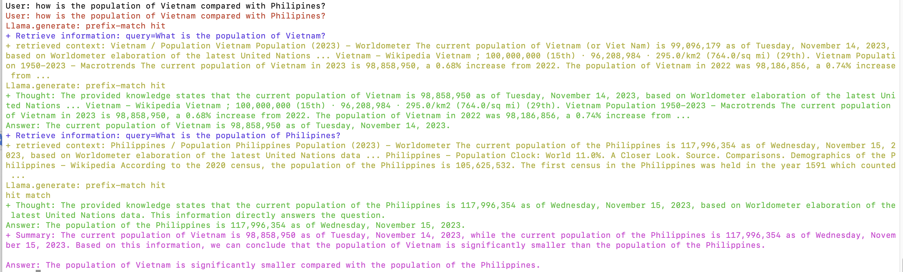

# QA Expert: LLM for Multi-hop Question Answering

QA Expert is a Language Model (LLM) specifically fine-tuned for the task of Question Answering, with a strong emphasis on addressing Multi-hop Question Answering scenarios.

<p align="center">
  
</p>
<p align="center">
An example of 1-shot question (single question) and how QA Expert LLM handle multi-hop Q&A</p>

<p align="center">
  
  
</p>
<p align="center">
Examples of 2-shot questions and how QA Expert LLM handle multi-hop Q&A. The left is an example of bridging entitiy and the right is an example of comparing entities</p>

Multi-hop Question Answering is a task that necessitates the retrieval of multiple contexts, followed by their integration to deduce the answer to the question. 

QA Expert will analyze the question, if the question is a single question, it will use the question as the query for retrieval and retrieve once. If it is a multi-hop question, it will call the function: `retrieve` multiple times with different queries and finally summarize the retrieval contexts to generate the final answer. 


## News
- [2023/11/12] We released our finetuned model: <b>khaimaitien/qa-expert-7B-V1.0</b>based on [mistralai/Mistral-7B-v0.1](https://huggingface.co/mistralai/Mistral-7B-v0.1) + our training data: [khaimaitien/qa-expert-multi-hop-qa-V1.0](https://huggingface.co/datasets/khaimaitien/qa-expert-multi-hop-qa-V1.0)

## Table of Content
- [QA Expert: LLM for Multi-hop Question Answering](#qa-expert-llm-for-multi-hop-question-answering)
  - [News](#news)
  - [Table of Content](#table-of-content)
  - [Usage](#usage)
    - [Model Download](#model-download)
    - [Inference](#inference)
    - [Demo](#demo)
      - [Asking any free-domain question using Google Search API (through SERP API) as retrieval function](#asking-any-free-domain-question-using-google-search-api-through-serp-api-as-retrieval-function)
      - [Asking questions within a folder of txt files](#asking-questions-within-a-folder-of-txt-files)
  - [Training Data](#training-data)
  - [Training](#training)
  - [Evaluation](#evaluation)
  - [Citation](#citation)


## Usage
### Model Download

Our model was finetuned on our **generated data** using OpenAI model (**gpt-3.5-turbo-instruct**) with [mistralai/Mistral-7B-v0.1](https://huggingface.co/mistralai/Mistral-7B-v0.1) as the base model.

| Size | Hugging Face Repo | Base Model |
| ---  | --- | --- |
| 7B | [khaimaitien/qa-expert-7B-V1.0](https://huggingface.co/khaimaitien/qa-expert-7B-V1.0) | [mistralai/Mistral-7B-v0.1](https://huggingface.co/mistralai/Mistral-7B-v0.1) |

You can also find model in GGUF (for [Llama.cpp](https://github.com/ggerganov/llama.cpp)):

| Size | Hugging Face Repo |
| ---  | --- |
| 7B | [khaimaitien/qa-expert-7B-V1.0-GGUF](https://huggingface.co/khaimaitien/qa-expert-7B-V1.0-GGUF) | 
### Inference 
Curently we support 3 types of inference:
+ Using [Huggingface Transformers](https://github.com/huggingface/transformers)
+ Using [Vllm](https://github.com/vllm-project/vllm)
+ Using [llama.cpp](https://github.com/ggerganov/llama.cpp)


First please install the requirements:
```shell
pip install -r requirements.txt
```

The example for using transformers HuggingFace:

```python 

from qa_expert import get_inference_model, InferenceType

def retrieve(query: str) -> str:
    # You need to implement this retrieval function, input is a query and output is a string
    # This can be treated as the function to call in function calling of OpenAI
    return context

model_inference = get_inference_model(InferenceType.hf, "khaimaitien/qa-expert-7B-V1.0")
answer, messages = model_inference.generate_answer(question, retriever_func)
```
**For Vllm**, you need to install Vllm (```pip install vllm==0.2.1```) and change the InferenceType to vllm:
```python
model_inference = get_inference_model(InferenceType.vllm, "khaimaitien/qa-expert-7B-V1.0")
```
**For LLama.cpp**, you need to install: [llama-cpp-python](https://github.com/abetlen/llama-cpp-python)

You need to download one of **gguf files** from here: [khaimaitien/qa-expert-7B-V1.0-GGUF](https://huggingface.co/khaimaitien/qa-expert-7B-V1.0-GGUF/tree/main). For example:
```shell
wget https://huggingface.co/khaimaitien/qa-expert-7B-V1.0-GGUF/resolve/main/qa-expert-7B-V1.0.q4_0.gguf
```
Then pass the downloaded folder to the: ``get_inference_model``. 
```python
# Use q4_0
model_inference = get_inference_model(InferenceType.llama_cpp, "qa-expert-7B-V1.0.q4_0.gguf")
# Use q8_0
model_inference = get_inference_model(InferenceType.llama_cpp, "qa-expert-7B-V1.0.q8_0.gguf")
```
### Demo

#### Asking any free-domain question using Google Search API (through SERP API) as retrieval function
You can run this using Hugging Face Tranformers inference:
```shell
python run_retrieval_google.py --qa-model khaimaitien/qa-expert-7B-V1.0 --inference-type hf
```
Once the model is loaded, you can ask any free-domain question and watch the process of handling the queries:

+  Retrieve Information (green): step to retrieve relevant information
+  retrieved context (yellow): the result of the retrieve function
+  Thought: the reasoning generated by model 
+  Summary: summarizing retrieved information to form the final answer
+  Answer: the final answer to the question.

You can also use Llama.cpp as inference type by: first **download the GGUF model**: 
```shell 
wget https://huggingface.co/khaimaitien/qa-expert-7B-V1.0-GGUF/resolve/main/qa-expert-7B-V1.0.q4_0.gguf
```
Then run:

```shell
python run_retrieval_google.py --qa-model qa-expert-7B-V1.0.q4_0.gguf --inference-type llama_cpp
```

The default serper_api_key is ``e9b35305c3b0a79189b7c2dc4c37adbc587d1e65``, this is the API_KEY of **my free account and limited to 2500 queries**. You can use your API KEY by passing: ``--serper-api-key YOUR_KEY``

<p align="center">
  
</p>
<p align="center">
Example for answering question: <b>"how is the population of Vietnam compared with Philipines"</b></p>

<p align="center">
  
</p>
<p align="center">Example for answering question: <b>"what are some tourist attractions in the biggest city in Japan?" </b> </p>

#### Asking questions within a folder of txt files
You can run ```run_example.py```. This example allows you to pass in a folder (**--data-folder**) containing the .txt files, it will read all .txt files inside the folder and split them into paragraphs, then paragraphs are represented as vectors by an embedding model (here, I use: [intfloat/e5-base-v2](https://huggingface.co/intfloat/e5-base-v2)) to be indexed in a vector DB (Here we use [Chromadb](https://www.trychroma.com/)). The retrieve function will search over indexed paragraphs to find the most relevant one.

```shell 
python run_example  --data-folder extra_data/test_data/cities --qa-model khaimaitien/qa-expert-7B-V1.0 --inference-type hf
```
Options:
+ **--data-folder** (default=extra_data/test_data/cities): The folder containing the .txt files to create indexed paragraphs for retrieval
+ **--qa-model**: The path to the model Hugging Face path or local folder
+ **--inference-type**: one of: vllm, hf, llama_cpp. If it is: llama_cpp, the --qa-model must be local folder downloaded from: https://huggingface.co/khaimaitien/qa-expert-7B-V1.0-GGUF
+ **--num-paragraphs**: number of paragraphs retrieved for each query

Here I already added 2 folders for testing:
+ **extra_data/test_data/cities**: List of 100 cities in United States, each is associated with a .txt file containing text from Wikipedia
+ **extra_data/test_data/states**: List of 50 states in United States, each is associated with a .txt file containing text from Wikipedia

Some results: 
  

## Training Data
The training data was generated using **gpt-3.5-turbo-instruct** from OpenAI. 
You can find more detail from: [gen_data/README.md](gen_data/README.md)
## Training
We use **packing inputs without cross-contamination** to speed up the training. You can take a look at [train/README.md](train/README.md)
## Evaluation
Please take a look at the Section **Evaluation** of [train/README.md](train/README.md#evaluation)
## Citation
If you feel my work is helpful, please kindly cite as:
```bibtex
@Misc{qa-expert,
      title={QA Expert: LLM for Multi-hop Question Answering},
      author={Khai Mai},
      howpublished={\url{https://github.com/khaimt/qa_expert}},
      year={2023},
}
```