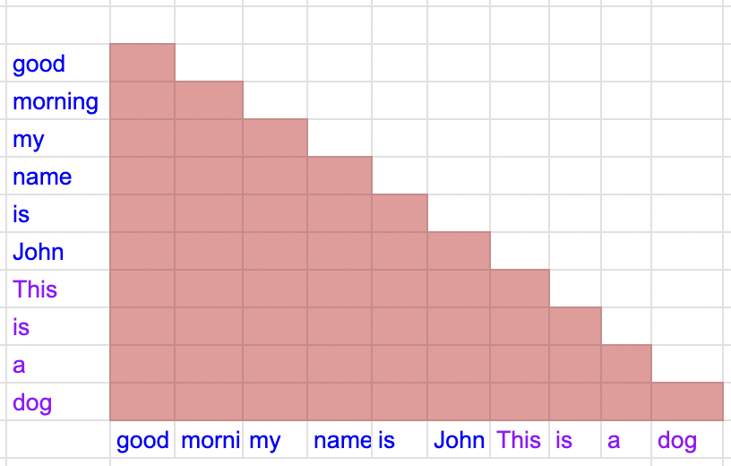
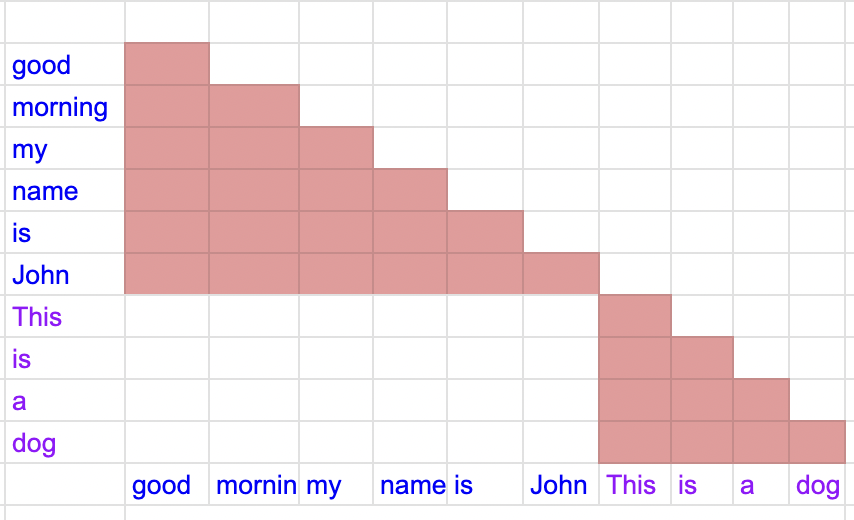

# Training

## Content
- [Training](#training)
  - [Content](#content)
  - [Installation](#installation)
  - [Use Monkey-Patched MistralForCausalLM](#use-monkey-patched-mistralforcausallm)
  - [Training script](#training-script)
    - [Single GPU](#single-gpu)
    - [Multiple GPU](#multiple-gpu)
    - [Merge Adapter weights in Lora](#merge-adapter-weights-in-lora)
    - [Some notes about training](#some-notes-about-training)
  - [Evaluation](#evaluation)

## Installation
You first need to install requirements (the ``requirements.txt`` in this folder):
```shell
pip install -r requirements.txt
```
## Use Monkey-Patched MistralForCausalLM
To speed up training, I had adopted the monkey-patched ``MistralForCausalLM`` for handling packing input sequences from [this repo](https://github.com/MeetKai/functionary/blob/packing_for_flash_attention/functionary/train/monkey_patch/mistral_monkey_patched.py). What the monkey-patched MistralForCausalLM really handles is to make sure **no cross-contamination** in attention when packing short inputs. 

Specifically, when we pack short input sequences into one sequence, the attention should be only within individual sequences. For example, if we merge 2 input sequences: packed sequence = [sequence 1] [sequence 2]. Tokens from **sequence 1** only attend to other tokens in **sequence 1** and tokens from **sequence 2** only attend to other tokens in **sequence 2**

<p align="center">
  
  
</p>
<p align="center">
Examples of packing 2 input sequences: "good morning my name is John" and "This is a dog". The left is the attention matrix of packing with cross-contamination, the right is the correct attention matrix of packing</p>

## Training script
First, you need to download the training data from: [khaimaitien/qa-expert-multi-hop-qa-V1.0](https://huggingface.co/datasets/khaimaitien/qa-expert-multi-hop-qa-V1.0) and save to a folder to pass in arguments: ``train_path`` and ``validation_path``

In this repo, we support training the **whole model** or **lora** or **qlora**, and currently only 2 types of model: **Mistral or Llama2**. Based on my experience and also many people report, the Mistral-7B can outperform Llama2-13b so we decided to train on Mistral only.

Some noticeable arguments in the training you should pay attention to:
+ **--model_name_or_path**: pretrained model
+ **--train_path**: training file, you can download from: [khaimaitien/qa-expert-multi-hop-qa-V1.0](https://huggingface.co/datasets/khaimaitien/qa-expert-multi-hop-qa-V1.0)
+ --validation_path: validation file, you can download from: [khaimaitien/qa-expert-multi-hop-qa-V1.0](https://huggingface.co/datasets/khaimaitien/qa-expert-multi-hop-qa-V1.0)
+ **--model_type**: "mistral" or "llama"
+ **--use_lora**: True if using lora, False if training the whole model
+ **--qlora**: If use_lora=True, we can choose to use qlora or not, True if use qlora
+ **--model_max_length**: The maximum sequence length, default=4096
+ **--packing**: True if using packing short inputs , False if not. We recommend using packing

### Single GPU
Example for training on 1 GPU, not using lora:

```
python -m train.train_model \
    --model_name_or_path Mistral-7B-v0.1 \
    --train_path train_data/train.json \
    --validation_path train_data/validation.json \
    --model_type mistral \
    --use_lora False \
    --qlora False \
    --bf16 True \
    --output_dir models/mistral-qa_full \
    --num_train_epochs 2 \
    --per_device_train_batch_size 3 \
    --per_device_eval_batch_size 4 \
    --gradient_accumulation_steps 10 \
    --eval_accumulation_steps 1 \
    --evaluation_strategy "steps" \
    --eval_steps 40 \
    --save_strategy "epoch" \
    --save_steps 80 \
    --save_total_limit 3 \
    --learning_rate 1.2e-5 \
    --lr_scheduler_type "cosine" \
    --logging_steps 1 \
    --tf32 True \
    --model_max_length 4096 \
    --gradient_checkpointing True \
    --packing True
```


### Multiple GPU
To train on Multiple GPUs, I suggest using **deepspeed** as many people reported that training Mistral model encounters loss instability using FSDP: https://github.com/huggingface/transformers/issues/26498

Also, Another note is: **FSDP doesn't work** for Lora because it requires all the parameters to be uniformly trainable or freezed. 

Here is an example:
```
deepspeed train/train_model.py \
    --model_name_or_path Mistral-7B-v0.1 \
    --train_path train_data/train.json \
    --validation_path train_data/validation.json \
    --model_type mistral \
    --use_lora False \
    --qlora False \
    --bf16 True \
    --output_dir models/mistral-qa_full \
    --num_train_epochs 2 \
    --per_device_train_batch_size 3 \
    --per_device_eval_batch_size 4 \
    --gradient_accumulation_steps 10 \
    --eval_accumulation_steps 1 \
    --evaluation_strategy "steps" \
    --eval_steps 40 \
    --save_strategy "epoch" \
    --save_steps 80 \
    --save_total_limit 3 \
    --learning_rate 1.2e-5 \
    --lr_scheduler_type "cosine" \
    --logging_steps 1 \
    --tf32 True \
    --model_max_length 4096 \
    --gradient_checkpointing True \
    --packing True\
    --deepspeed train/ds_config/zero3_wo_offload.json
```
### Merge Adapter weights in Lora
If you train the model using lora or qlora (--use_lora True), you need to merge the adapter weights to original weights. You can do it by running this script:
```shell
python -m train.merge_weight save_folder: str, pretrained_path: str, checkpoint: str, model_type: str)
```
Where:
+ **save_folder**: Where to save the merged model (final model to use)
+ **pretrained_path**: path to pretrained_path in finetuning
+ **checkpoint**: checkpoint folder, containing the adapter weights
+ **model_type**: mistral or llama

### Some notes about training
Here are some notes about training based on my experience:

+ Mistral-7B outperforms Llama-2-13b considerably althoug it is much smaller in size
+ **Using packing saves a lot of training time**. For example, the number of data points in training dataset is **25547**, if using packing, the number of data points is reduced to: **5173** --> the training time is almost only **1/5** of that without packing.
+ If you are using A100 to train the model, you should use deepspeed zero3 without offloading [ds_config/zero3_wo_offloading.json](ds_config/zero3_wo_offloading.json). If you are using A6000 to train the model, you should use deepspeed zero3 with offloading [ds_config/zero3.json](ds_config/zero3.json). 
+ FSDP brings about loss instability in training Mistral model, more information from [here](https://github.com/huggingface/transformers/issues/26498)
+ [vast.ai](https://vast.ai/) provides a little bit **cheaper price** than [runpod.io](https://www.runpod.io/)

## Evaluation
We use [HotpotQA](https://hotpotqa.github.io/) as the evaluation dataset and measure the metrics: 
+ **Recall**: compute the recall based on the individual words, the reason we use recall instead of F1 because the ground-truth answers are short and usually spans.
+ **Accuracy of containing ground-truth**: If the ground-truth answer (mostly short span) is exactly in the generated answer --> 1 else 0

Here is the result:

|Model|Recall|Accuracy of containing ground-truth|
|---|---|---|
|[khaimaitien/qa-expert-7B-V1.0](https://huggingface.co/khaimaitien/qa-expert-7B-V1.0)|0.7257|0.668|


You can run the evaluation script at the root directory of this repo:

```shell
python eval_hotpot_qa.py --model-path khaimaitien/qa-expert-7B-V1.0 --inference-type vllm
```
Note that using ``vllm`` would be much faster than ``hf``